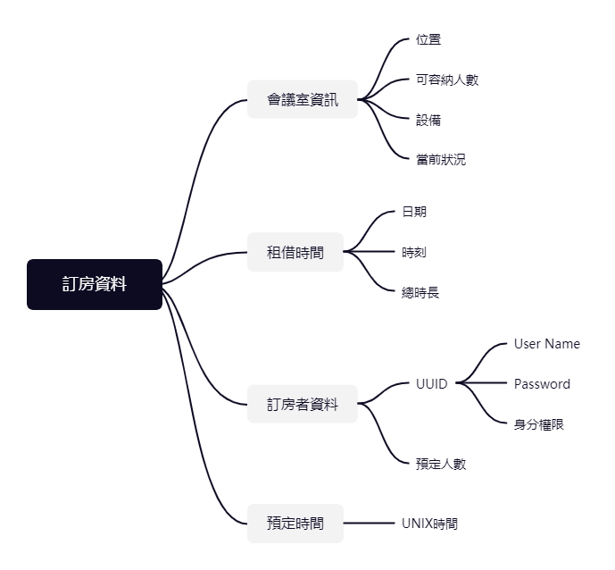
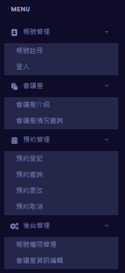

Software Design Document

for

學校會議室預約系統

(Virtual Room Reservation Assistant)

Group15

Prepared by:

B10730017 資工三甲 鄭驊成

# 

[**1. INTRODUCTION**](#_a5sh38nt3h4w) **3**

>   [1.1  Purpose](#_5lh87l1vbwgp) 3

>   [1.2  Scope](#_gin4gflidooa) 3

>   [1.3  Overview](#_jrx0h2f7ly1k) 3

>   [1.5  Definitions and Acronyms](#_buyz9gewkefd) 3

[**2. SYSTEM OVERVIEW**](#_figfjuwbgzmr) **4**

[**3. SYSTEM ARCHITECTURE**](#_4xwj0t4staup) **4**

>   [3.1  Architectural Design](#_bm7lu7af5933) 4

>   [3.2  Decomposition Description](#_805jdbvsv58s) 6

>   [3.3  Design Rationale](#_asfdpdgjts0r) 6

[**4. DATA DESIGN**](#_u0thkhomrsa) **7**

>   [4.1  Data Description](#_xfrqxqyk12lk) 7

>   [4.2  Data Dictionary](#_ekk76s9xijnq) 8

[**5. COMPONENT DESIGN**](#_k9adrhagf3n6) **9**

[**6. HUMAN INTERFACE DESIGN**](#_555n3uw8oymh) **10**

>   [6.1  Overview of User Interface](#_rn06l2egso3m) 10

>   [6.2  Screen Images](#_to7257xlfcx4) 11

>   [6.3  Screen Objects and Actions](#_jefgilwxn0ab) 14

[**7. REQUIREMENTS MATRIX**](#_g1p1gtsi8jlm) **16**

[**8. APPENDICES**](#_ln7ykn56qhb4) **17**

#   

# 1. INTRODUCTION 

## 1.1 Purpose 

軟體設計說明的目的是確定需要在SRS中指定編碼的內容。在此文件中，描述系統能夠提供已認證的用戶預約會議室功能，並且對預約進行後續處理(基本CRUD功能)。而管理員可以更改預約及會議室介紹等，並對使用者進行權限更改。

## 1.2 Scope 

在本文檔中，將對客房預訂系統進行詳細說明。我們的客房預訂系統項目將具有web介面。在web介面中，共有兩種用戶類型，分別是管理員以及一般用戶。每種用戶類型具有訪問系統的

不同授權。

## 1.3 Overview

本文件是根據軟件設計文檔的標準“ IEEE Recommended Practice for Software Design
Descriptions”編寫。第3至5節包含有關項目設計的討論，並帶有圖表解釋。第6節顯示了系統的UI樣本，實現方式則在網頁上呈現。第7節顯示表格，說明系統跟需求。附錄包含系統所需的設置和配置，其開發環境和需要工具。

1.4 Reference Material

台灣科技大學圖書館討論小間借用系統：<https://space.lib.ntust.edu.tw/lib/space.php>

高雄醫學大學會議場地管理系統：
<http://www.kmuh.org.tw/info/admin/meeting/querymeetingz.asp>

國立臺灣師範大學教室預約現況查詢：
<https://ap.itc.ntnu.edu.tw/Classroom/calendar.do?mgn=0&action=show>

臺北市政府公有場地租用：
<https://service.gov.taipei/rental/VenueDetail/9c5e1fd2feed>

IEEE Recommended Practice for Software Design Descriptions：
<https://ieeexplore.ieee.org/document/741934>

## 1.5 Definitions and Acronyms

| DB   | 資料庫           |
|------|------------------|
| GUI  | 圖形用戶介面     |
| HW   | 硬體             |
| IDE  | 集成開發環境     |
| SDD  | 軟體設計說明     |
| SPMP | 軟體項目管理計畫 |
| SQL  | 結構化查詢語言   |
| SRS  | 軟體需求規範     |
| SW   | 軟體             |

# 2. SYSTEM OVERVIEW 

對於使用者知道計算機和網頁的基本操作，還了解用於操作的標準術語。

會議室預訂系統是一個基於網頁的項目，可幫助用戶查看目前的房間狀態。基於Web的統一清單系統設計為可在所有操作系統上使用。
可通過連接到服務器的任何筆記本電腦和桌上型電腦隨時都可以訪問該系統。當訂房時，會議室預訂系統具有消息傳遞，發送電子郵件通知訂房成功。

# 3. SYSTEM ARCHITECTURE

## 3.1 Architectural Design

**3.1.1 Admin System**

Identification: Admin

Type: Application

Purpose: User query and user authority operation

**3.1.2 Reservation System**

Identification: Reservation

Type: Application

Purpose: Let users make appointments

**3.1.3 Account System**

Identification: Account

Type: Application

Purpose: Fill in account information and login prompt

**3.1.4 Room**

Identification: Room

Type: Data

Purpose: Display

**3.1.5 User**

Identification: User

Type: Data

Purpose: Display

**3.1.6 Reservation**

Identification: Reservation

Type: Process

## 3.2 Decomposition Description 

## 3.3 Design Rationale 

The functional requirement of the artefact is divided into two classes:

我們可以將系統分成若干個子系統，在這裡我們分出3個子系統(帳戶管理、預約、管理員系統)，彼此之間獨立的運作，管理底下的資源。

**帳戶管理系統會有以下的頁面:**

**1. 歡迎頁面:**

此頁面允許新學生登錄並更新他們的信息以獲得用戶的名稱和密碼。他還使以前的用戶可以訪問鏈接到登錄頁面的連接，讓他們可以訪問主頁。

**2. 更新詳細信息頁面:**

此頁面允許學生更新信息，包含登錄詳細信息。

**3. 登錄頁面:**

該頁面用於用戶身分驗證，僅允許授權用戶訪問該網站。

**預約系統會有以下的頁面:**

**4. 可用性頁面:**

此頁面是為每個用戶設計的，它顯示了所有可用房間的列表。

**5. 預定頁面:**

此頁面允許用戶預訂房間，並且在單擊預訂按鈕後，自動更新預訂房間的可用性。

**管理員系統會有以下的頁面:**

**6. 管理員登錄頁面:**

該頁面對管理員進行身分驗證，以獲取對管理員主頁的訪問權限。

# 4. DATA DESIGN 

## 4.1 Data Description 

註：從UUID處追溯自該預訂者的帳號資料。

註：從預約紀錄處追溯至該帳號持有者的訂房資料。

## 4.2 Data Dictionary 

| 名稱       | 內容                                                                       | 資料類型          |
|------------|----------------------------------------------------------------------------|-------------------|
| 訂房者資料 | 內含此次預定會議室的預定人、預計使用人數。                                 | class             |
| 預定人數   | 預計使用者人數。                                                           | int               |
| UUID       | 可指向唯一使用者。                                                         | int               |
| UserName   | 使用者自訂的名稱。                                                         | string            |
| Password   | 使用者自訂的登入密碼，使用SHA256雜湊演算後儲存其結果。                     | long long int [4] |
| 身分權限   | 該帳號持有者的身分權限，以內部代碼儲存。                                   | int               |
| 預定時間   | 使用UNIX時間儲存此次預定表單發送的時間。                                   | int               |
| 租借時間   | 保存了日期、租借開始時刻與租借總時間的類別。                               | class             |
| 日期、時刻 | 日期與租借開始時刻。                                                       | int               |
| 租借總時間 | 預計租借的總時間。                                                         | int               |
| 會議室資訊 | 列出各個會議室所有的資訊。包含位置、可容納人數、內置設備與當前使用狀況等。 | class             |
| 位置       | 該會議室的位置。                                                           | int               |
| 可容納人數 | 建議容納人數。                                                             | int               |
| 設備       | 內部有無哪些設備。                                                         | boolean array     |
| 當前狀況   | 使用內部的狀態號碼表示該會議室當前狀況。                                   | int               |

※ If you provided a functional description in Section 3.2, list all the
functions and function parameters.

# 5. COMPONENT DESIGN 

程式功能：

| 函數名稱         | 參數                 | 備註                           |
|------------------|----------------------|--------------------------------|
| 創建使用者       | 姓名、身分、系級等   | 新用戶新增帳號                 |
| 修改使用者       | 身分證字號為首等     |                                |
| 查詢使用者       | 身分證字號           |                                |
| 刪除使用者       | 身分證字號           |                                |
| 登入使用者       | 帳號、密碼           |                                |
| 會議室新增       | 地點、可借用時段等   |                                |
| 會議室刪除       | 會議室代號           |                                |
| 會議室修改       | 會議室代號跟修改資訊 |                                |
| 會議室查詢       | 會議室代號           |                                |
| 預約登記         | 使用時段、地點等     |                                |
| 預約查詢         | 預約代號             |                                |
| 預約更改         | 預約代號為首等       |                                |
| 預約取消         | 預約代號             |                                |
| 變更使用者權限   | 身分證字號、等級     | 當用戶不當使用將調整權限       |
| 查詢可借用會議室 | 會議室代號           | 藉由"會議室查詢"找尋可借用時段 |

# 6. HUMAN INTERFACE DESIGN 

## 6.1 Overview of User Interface 

使用者：1.學生/教職人員 2.管理員

子系統：1.預約系統 2.帳號系統 3.後台管理系統

| 頁面               | 顯示內容                                                   | 連接頁面                                                        | 備註                                    |
|--------------------|------------------------------------------------------------|-----------------------------------------------------------------|-----------------------------------------|
| 首頁               | 借用規則 當前使用者                                        | 帳號註冊 使用者登入 會議室介紹 會議室情況查詢 預約登記 預約查詢 |                                         |
| 帳號註冊           | 申請限制 基本資料填寫(身分/系級/身分證)                    | 首頁 使用者登入                                                 |                                         |
| 使用者登入         | 登入提示 帳號密碼填寫                                      | 首頁                                                            |                                         |
| 會議室介紹         | 會議室圖片跟基本資訊(人數/地點) 相對位置地圖               | 首頁 會議室情況查詢 預約登記                                    |                                         |
| 會議室借用情況查詢 | 會議室基本資訊 近期被借用時段                              | 首頁 預約登記                                                   |                                         |
| 預約登記           | 預約規則 使用時段、地點、使用目的、人數填寫 提示可申請時段 | 首頁 會議室介紹                                                 | 1.需要先登入 2.額外器材借用(選擇性實作) |
| 預約查詢           | 過往的申請地點、時段、申請人、提交申請時間 查詢篩選        | 首頁 預約更改 預約取消                                          | 1.需要先登入 2.可以更改未來時段的借用   |
| 預約更改           | 更改規則 更改項目：申請地點、時段                          | 首頁                                                            | 1.需要先登入                            |
| 預約取消           | 取消規則                                                   | 首頁                                                            | 1.需要先登入                            |
| 帳號權限管理       | 用戶查詢 用戶權限操作                                      | 首頁                                                            | 1.僅限管理員                            |
| 會議室資訊編輯     | 會議室查詢 內容更改選項                                    | 首頁                                                            | 1.僅限管理員                            |

## 6.2 Screen Images

1.  首頁：進入系統一開始畫面，顯示基本預約規則跟注意事項。

2.  帳號註冊：頁面提醒帳號註冊的事項跟限制，再來填寫基本資料表單即可註冊。

3.  使用者登入：輸入正確帳號密碼即可登入，可選擇記住帳號。

4.  會議室介紹：列出所有會議室資訊，包括位置、可借用時段、可容納人數等資訊。

5.  會議室借用情況查詢：查詢尚可借用的會議室，藉由左方日歷可以指定日期，而右方則顯示當天的各時段是否已被預約。

6.  預約登記：以表單形式呈現，填寫時間地點等資料，根據登入者自動帶入申請者預約。

7.  預約查詢、更改、取消：先進入預約查詢頁面，即可看到更改跟取消預約的選項。

## 6.3 Screen Objects and Actions

除了登入畫面，每個頁面左上方都有回首頁的logo超連結，和左方的菜單可以切換不同頁面。

1.  首頁

| 物件     | 呈現方式 | 功能                       |
|----------|----------|----------------------------|
| 系統簡介 | 條例文字 | 讓使用者知道系統使用跟限制 |

1.  帳號註冊

| 物件       | 呈現方式     | 功能                             |
|------------|--------------|----------------------------------|
| 申請限制   | 條例文字     | 讓使用者知道系統使用跟限制       |
| First name | 文字輸入欄位 | 使用者英文名字的名               |
| Last name  | 文字輸入欄位 | 使用者英文名字的姓               |
| Username   | 文字輸入欄位 | 使用者中文名字                   |
| 身分       | 文字選擇器   | 可以選擇身分為學生/老師/教職人員 |
| 系所班級   | 文字輸入欄位 | 若使用者為學生填入所在系所跟年級 |
| 身分證字號 | 文字輸入欄位 | 用以區別相同姓名的使用者         |
| 電子信箱   | 文字輸入欄位 | 用以寄發會議室變動通知           |

1.  使用者登入

| 物件       | 呈現方式     | 功能                           |
|------------|--------------|--------------------------------|
| 系統logo   | 圖片         | 回到首頁                       |
| Username   | 文字輸入欄位 | 使用者帳號                     |
| Password   | 文字輸入欄位 | 使用者密碼                     |
| 記住我帳號 | 核取方塊     | 下次登入記住使用者帳號         |
| 登入       | 按鈕         | 送出帳號密碼驗證               |
| 創新帳戶   | 按鈕         | 進入帳號註冊頁面               |
| 忘記密碼   | 按鈕         | 跳出通知藉由驗證身分證字號找回 |

1.  會議室介紹

| 物件       | 呈現方式 | 功能                             |
|------------|----------|----------------------------------|
| 會議室資訊 | 表格     | 呈現會議室地點、可借用時間等資訊 |

1.  會議室借用情況查詢

| 物件       | 呈現方式 | 功能                           |
|------------|----------|--------------------------------|
| 年份、月份 | 綠色文字 | 顯示下方日期當前年月份         |
| 上個月     | 按鈕     | 將當前月份往前推一個月         |
| 下個月     | 按鈕     | 將當前月份往後推一個月         |
| 日期       | 按鈕     | 點選日期將右方時程表切換到當天 |
| 時程表     | 表格     | 顯示當天可預約時段             |

1.  預約登記

| 物件     | 呈現方式     | 功能                     |
|----------|--------------|--------------------------|
| 預約地點 | 文字選擇器   | 選擇會議室地點           |
| 預約日期 | 日期輸入欄位 | 選擇未來的日期           |
| 開始時間 | 時間輸入欄位 | 選擇預約日期當天開始時間 |
| 結束時間 | 時間輸入欄位 | 選擇預約日期當天結束時間 |
| 申請人   | 文字輸入欄位 | 使用者中文名字           |
| 會議人數 | 數字輸入欄位 | 開會人數                 |
| 會議目的 | 文字輸入欄位 | 用以檢視使用正當性       |

1.  預約查詢、預約更改、預約取消

| 物件       | 呈現方式 | 功能                       |
|------------|----------|----------------------------|
| 使用者圖片 | 圖片     | 讓管理員識別用             |
| 使用者名稱 | 文字     | 選擇未來的日期             |
| 使用者資訊 | 文字     | 使用者身分、系所班級等資訊 |
| 總借用次數 | 文字     | 累績至今所有借用次數總和   |
| 總借用時數 | 文字     | 累績至今所有借用時數總和   |
| 預約紀錄   | 表格     | 包含過去至未來的預約       |
| 更改預約   | 按鈕     | 跳出小視窗更改未來的預約   |
| 取消預約   | 按鈕     | 取消未來的預約             |

# 7. REQUIREMENTS MATRIX 

| 要求                   | 實現                                                                                                              |
|------------------------|-------------------------------------------------------------------------------------------------------------------|
| 2.1.1. 登入系統        | 利用UserName、UUID等方式確認唯一使用者身分，配合密碼實作。請參照附錄3。                                           |
| 2.1.2. 3.1.1. 查詢系統 | 使用class替每間會議室附上參數等特徵令其可以被查詢。請參照附錄3。                                                  |
| 2.1.3. 3.1.2. 預定系統 | 配合登入系統、查詢系統等系統寫入預定資料。請參照附錄3。                                                           |
| 2.1.4. 3.1.3. 取消系統 | 配合登入系統、預定系統等釋放空會議室。請參照附錄3。                                                               |
| 3.1. 使用者介面        | 已在本文件之6.1. 6.2. 部分實作。請參照附錄3。                                                                     |
| 4.3. 外部攻擊安全需求  | 如本文件4.2. 節所述，密碼的存儲使用SHA256等雜湊演算法儲存密文而不儲存明文，即使被惡意入侵竊取密碼也只能得到密文。 |
| 4.4. 易用性需求        | 介面簡潔明瞭，在本文件第六章節中提供許多程式運行截圖可以看到本程式使用之便利性。                                  |

#   

# 8. APPENDICES 

1.本軟體將使用Visual Studio Code進行開發，在Google Chrome上進行測試。

2.本軟體之介面提供如附圖。

帳號註冊與登入系統將與使用者資料連結。如前所述，即SRS文件中2.1.1.節的登入系統。點擊即可進入帳號註冊與登入系統。

而後台管理系統的帳號權限管理與此系統對應。

會議室與預約管理系統將與會議室資料連結。即2.1.2.\~2.1.4.節的查詢、預約、取消系統。

會議室情況查詢主要顯示會議室的租借情況，而會議室介紹將呈現一般性特徵。

後臺管理系統的會議室資訊編輯與此對應。

預約管理的查詢系統將可查詢該使用者目前以來所有的預約紀錄。
